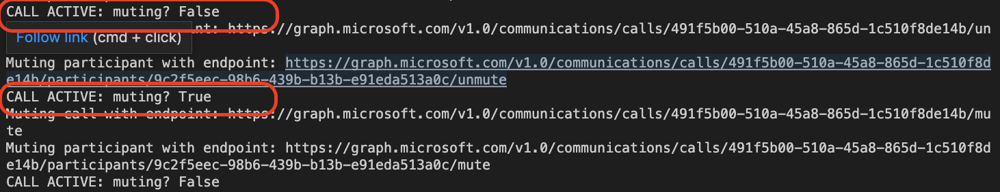

---

Project Title: "Microsoft Team mute switch"
Breif description: "An IoT enabled switch that mutes and unmute a user on a Microsoft Teams call"

languages:
  - python 
  - C++
# products/modules used:
#   - azure-active-directory
#   - microsoft-graph-api
#   - Bleak-python-module

---

## About this project

### Overview

This project shows how to use a switch to mute and unmute a user on a teams call. It involves the development of a Python console application and an IoT embedded device. The Python app uses the Mircosoft Graph API to communicate with the user data in Azure Active Directory, while it gets the switch press and release event from the hardware via BLE, the hardware  consist of an esp32 and a 16mm led switch.

This repo includes the python desktop application, the esp32 firmware source code as well as the hardware design.
The purpose of this project is to provide a solution that enables user quickly mute and unmute their microphone while on a teams call, this would improve the user experience while using teams, the switch features a led that lights up and provide a good visual feedback that assures the user if they are muted in their active call or not. 

### Scenario

The console application:

- Gets a token from microsoft identity platform in its own name (without a user)
- Waits for a call from the user 
- After receiving a call from user, it answers the call, then saves the call id and participant id
- Connect to switch BLE receiver 
- Start listening to switch state from the esp32 via BLE 
- Send a mute or unmute command to the server via microsoft graph teams api depending on change of switch state  

The esp32 firmware: 

- Setup BLE, i.e. service id, characteristics id and switch input gpio 
- Start advertising BLE service
- On receiving PC connection it start to broadcast switch state

### System design
#### Console application 


#### Hardware design 


## Materials and tools used 
IDE: vs code 

### Python application 
1. [Python 3+](https://www.python.org/downloads/release/python-364/)
2. MSAL: The Microsoft Authentication Library is used to authenticate the user and retrieve the user data.
3. Bleak: Bleak is a GATT client software, capable of connecting to BLE devices acting as GATT servers, it is used to communicate with the esp32 module
4. An Azure Active Directory (Azure AD) tenant. For more information on how to get an Azure AD tenant, see [how to get an Azure AD tenant.](https://docs.microsoft.com/azure/active-directory/develop/quickstart-create-new-tenant)

### Esp32 firmare
1. Arduino sdk

### Hardware components 
1. [16mm Illuminated Pushbutton - Red Latching On/Off Switch](https://www.adafruit.com/product/1442) 
2. [ESP32-S3-DevKitM-1-N8 - ESP32-S3-MINI-1 Dev Board - 8 MB](https://www.adafruit.com/product/5311) 
3. [Breadboarding wire bundle](https://www.adafruit.com/product/153)
4. [Half-size breadboard](https://www.adafruit.com/product/64)
5. [Lithium Ion Battery - 3.7v 2000mAh](https://www.adafruit.com/product/2011)
6. [USB LiIon/LiPoly charger - v1.2](https://www.adafruit.com/product/259)
7. PLA Enclosure: 100mm x 100mm x 70mm 
8. [V2 usb cable](https://www.adafruit.com/product/260)

### Hardware Tools 
1. Soldering iron and lead 


## Build instructions

To run this sample, you'll need:

### Step 1:  Clone or download this repository

From your shell or command line:

```Shell
git clone git@github.com:cliffordolaw/msft_mute_button.git
```

Go to the `local repo` folder

```Shell
cd msft_mute_button
```

### Step 2:  Setup your Azure Active Directory application

NB: If you don't have a developer's account open one [here](https://docs.microsoft.com/en-us/windows/uwp/publish/opening-a-developer-account)

1. Register the Azure AD app: Go to Microsoft identity platform for developers [App registrations](https://go.microsoft.com/fwlink/?linkid=2083908) 

2. Select **New registration**.
  - In the **Name** section, enter a meaningful application name that will be displayed to users of the app, for example `teams-mute-app`.
  - In the **Supported account types** section, select **Accounts in any organizational directory (Any Azure AD directory - Multitenant) and personal Microsoft accounts (e.g. Skype, Xbox)**.
  - Select **Register** to create the application.

3. From the **Certificates & secrets** page, in the **Client secrets** section, select **New client secret**:
  
  - Type a key description (of instance `app secret`),
  - Select a key duration of either **In 1 year**, **In 2 years**, or **Never Expires**.
  - When you press the **Add** button, the key value will be displayed, copy, and save the value in a safe location.
  - You'll need this key later to configure the project in Visual Studio. This key value will not be displayed again, nor retrievable by any other means so record it as soon as it is visible from the Azure portal.
  
  
4. In the list of pages for the app, select **API permissions**
  - Click the **Add a permission** button and then,
  - Ensure that the **Microsoft APIs** tab is selected
  - In the *Commonly used Microsoft APIs* section, click on **Microsoft Graph**
  - In the **Application permissions** section, ensure that the right permissions are checked:
      a. CallRecords.Read.All 
      b. Calls.AccessMedia.All
      c. Calls.Initiate.All
      d. Calls.InitiateGroupCall.All
      e. Calls.JoinGroupCall.All
      f. Calls.JoinGroupCallAsGuest.All
      g. User.Read.All
      h. User.ReadWrite.All

  - Select the **Add permissions** button

5. At this stage permissions are assigned correctly but the client app does not allow interaction, no consent can be presented via a UI, therefore we have to give the application admin consent. Click the **Grant/revoke admin consent for {tenant}** button, and then select **Yes** when you are asked if you want to grant consent for the requested permissions for all account in the tenant. You need to be an Azure AD tenant admin to do this.

    
  

6. On the app **Overview** page, find the **Application (client) ID** and **Directory (tenant) ID** values and record it for later. You'll need it to configure the Visual Studio configuration file for this project.
  
  
  
    
### Step 3:  Configure the console application (Python-desktop-app) to use your Azure AD tenant

#### Configure the client application
1. Open the [`config_param.json`](./python_desktop_app/jsondata/config_param.json) file
2. Find the string key `tenant_id` replace it with your Azure AD tenant name (tenant id).
3. Find the string key `client_id` and replace the existing value with the application ID (clientId) copied from the Azure portal.
4. Find the string key `secret` and replace the existing value with the secret key you saved from the Azure portal.
5. Find the string key `callbackUri` and replace with a callback uri


### Step 4:  Setup your teams bot 
1. Create a new bot on [Bot framework](https://dev.botframework.com/bots/new). Alternately, you can also create your bot if you select the `Create a bot` button in the [Bot Framework portal](https://dev.botframework.com/bots).

2. Following the first link in No. 1, fill in the following input accordingly 
  
  

3. Add the `Microsoft Teams` channel to the bot.
  

4. On the configuration page of the `Microsoft Teams` channel
  - Select the Calling tab 
  - Select Enable calling
  - update `Webhook (for calling)` with the URI where you'd like to receive incoming call notifications and other events, for example https://contoso.com/teamsapp/api/calling.

  

5. Save all edits and publish bot 


### Step 5: Setup the hardware 
#### Connect the hardware components
 <!-- Connect the hardware components as shown in the [Hardware design](#Hardware-design) section of [System design](#System-design) -->
 Connect the hardware components as shown in the image below. The breadboard design doesn't include the specific esp32 devkit module used in this project because of it's shape wasn't available in the design software used, so I used the closest esp module shape that was available and this is the big white object with a blue screen on the breadboard. While making your connections simply connect your esp32 S3 devkit with the remaining components while following the pins used in the breadboard design.  

 

 Use the physical connection image below for more help
 

 See other hardware connection images for guidiance in the 

 ##### Instructions
  1. Plug the esp32-s3 Devkit to the breadboard
  2. Plug the resistor to the board (1k resistor)
  3. Connect four wires to the switch terminals. You can use a **Crimp terminal connector**, but in this project I soldered the wires to the termianls.
  4. Connect the +ve/Anode wire (solid orange wire) from the switch led to one terminal of the resistor
  5. Connect the other terminal of the resitor to the 3v3 pin on the esp32-S3
  6. Connect one Termianl (stripe green wire) of the button the the GND rail of the breadboard
  7. insert the following pins on a single row on the bread board
    - -ve/Cathode wire (Stripe orange wire) from the switch led
    - The second terminal of the switch button (solid green wire)
    - Pin 1 from the esp32-s3
  8. Connect the 5v and G pins from the esp32-s3 to the red (+) and blue (-) lines on the breadboard respectively
  9. Connect the Load + and - pins from the charging module to the same red (+) and blue (-) lines on the breadboard respectively
  10. verify that all connections have been made correctly, see close up images of each wiring in the  for more certainty
  11. Connect the Battery connector to the Batt terminal on the charging module
  12. Plug the charging module to a 5v usb power supply to charge the system, leave the battery for a few minutes to get properly charged
    **NB: If the application fails to find the BLE name of the esp32-s3 try powering the esp32-s3 directly, the battery may not yet be charged well enough**


#### Load the arduino code onto the esp32 module
  1. Download and install vs code 
  2. Download and install arduino IDE 
  3. Install arduino and c/c++ extension in vs code 
  4. Open the esp32_arduino_firmware project in vscode 
  4. Install the esp32-s3 board in vs code: 
    - Open command pallette `cmd shift p`
    - Enter `Arduino Board Manager`
    - Goto `Additional links`
    - Enter this link: `https://raw.githubusercontent.com/espressif/arduino-esp32/gh-pages/package_esp32_index.json`
  5. Select desired board: 
    - Open command pallette `shift cmd p`
    - Enter `change board type`
    - Select `Esp32-S3 Dev module`
  6. Connect esp32-s3 devkit board: 
    - command pallette
    - Enter `select serial port`
  7. Connect the cable to the "uart-usb" port and not "usb-otg" port, although both can be used to load the module but only "uart-usb" can be used for getting console debug messages 
  8. Install the [Button library by Michael Adams](https://www.arduino.cc/reference/en/libraries/button/)
    - Open command pallette `shift cmd p`
    - Enter `Arduino library manager`
    - Search for `Button` and install `Button by Michael Adams
  9. Open the main.ino file and run the "Arduino: Upload" command at the top right corner of the `main.ino` window 
    NB: ensure the hardware is powered up


### Step 6: Testing the application
1. Log on to your teams account  

2. Start a call with the teams bot you created, it should be present in your tenant 
  - First, you'll need to a virtual environment as follows:
    ```Shell
    virtualenv venv
    ```
  - Activate the virtual environment
    For Max:
    ```Shell
    source ./venv/bin/activate
    ```
    For Windows
    ```Shell
    ./venv/Scripts/activate
    ```

  - Install the dependencies using pip
    ```Shell
    pip install -r requirements.txt
    ```

    NOTE: A common error while running the application would be "BleakError("Bluetooth device is turned off")" all you have to do here is simply give the application permission to use the PC's Bluetooth, on mac this would be a pop up box. Also do not forget to fill up the "config_param.json" file appropriately
  
#### If the callbackUri was setup then simply place a call to the bot from inside microsoft teams applcation
  1. Run the pyton desktop application without any parameter
      ```Shell
      python app.py
      ``` 
      Output
    

  2. Goto the `calls` page
    

  3. Search for bot and start call
     

#### If the callbackUri isn't setup you can start the call from inside the client app
  1. Run the python app with the parameter `--call`
    

  2. The application will return a list of all the users in your tenant, first select your account index, then select the index of the user you want to call, in this sample I called both my microsoft developer account and my other individual account.
    

  3. After answering the call on your two devices just press the button and see the system in action 
    - The mute button retrieves the participant id
    - And mutes bot the bot and the first user from your selection in #2 above, although there is a limitation with the microsoft at the moment, the bot can only mute this user but cannot unmute. 
    


## More information
For more information, check out these recommended resources 
1. [Microsoft Graph Fundamentals for Beginners](https://www.youtube.com/watch?v=dt-uuYPO1nk&list=PLWZJrkeLOrbbmGIW-7znaSpRinp8d-1Dt&index=1)  (Highly recommended)
2. [Permissions and consent](https://docs.microsoft.com/en-us/azure/active-directory/develop/v2-permissions-and-consent) 
3. [Register an application with the Microsoft identity platform](https://docs.microsoft.com/en-us/graph/auth-register-app-v2) or 
4. [Register calls and meetings bot for Microsoft Teams](https://docs.microsoft.com/en-us/microsoftteams/platform/bots/calls-and-meetings/registering-calling-bot)

<!-- 
### Cover photos
## About the code
## Troubleshooting
## Contributing -->

