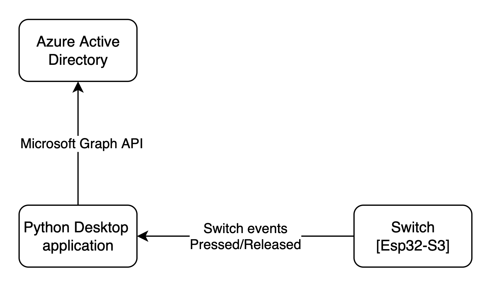

## About this project

### Overview

This project shows how to use a switch to mute and unmute a user on a teams call. It involves the development of a Python console application and an IoT embedded device. The Python app uses the Mircosoft Graph API to communicate with the user data in Azure Active Directory, while it gets the switch press and release event from the hardware via BLE, the hardware  consist of an esp32 and a 16mm led switch.

This repo includes the python desktop application, the esp32 firmware source code as well as the hardware design.
The purpose of this project is to provide a solution that enables user quickly mute and unmute their microphone while on a teams call, this would improve the user experience while using teams, the switch features a led that lights up and provide a good visual feedback that assures the user if they are muted in their active call or not. 

### Scenario

The console application:

- Gets a token from microsoft identity platform in its own name (without a user)
- Waits for a call from the user 
- After receiving a call from user, it answers the call, then saves the call id and participant id
- Connect to switch BLE receiver 
- Start listening to switch state from the esp32 via BLE 
- Send a mute or unmute command to the server via microsoft graph teams api depending on change of switch state  

The esp32 firmware: 

- Setup BLE, i.e. service id, characteristics id and switch input gpio 
- Start advertising BLE service
- On receiving PC connection it start to broadcast switch state

### System design
1. Console application 


2. Hardware design 


## Materials and tools used 
IDE: vs code 

### Python application 
1. [Python 3+](https://www.python.org/downloads/release/python-364/)
2. MSAL: The Microsoft Authentication Library is used to authenticate the user and retrieve the user data.
3. Bleak: Bleak is a GATT client software, capable of connecting to BLE devices acting as GATT servers, it is used to communicate with the esp32 module
4. An Azure Active Directory (Azure AD) tenant. For more information on how to get an Azure AD tenant, see [how to get an Azure AD tenant.](https://docs.microsoft.com/azure/active-directory/develop/quickstart-create-new-tenant)

### Esp32 firmare
1. Arduino sdk

### Hardware components 
1. [16mm Illuminated Pushbutton - Red Latching On/Off Switch](https://www.adafruit.com/product/1442) 
2. [ESP32-S3-DevKitM-1-N8 - ESP32-S3-MINI-1 Dev Board - 8 MB](https://www.adafruit.com/product/5311) 
3. [Breadboarding wire bundle](https://www.adafruit.com/product/153)
4. [Half-size breadboard](https://www.adafruit.com/product/64)
5. [Lithium Ion Battery - 3.7v 2000mAh](https://www.adafruit.com/product/2011)
6. [USB LiIon/LiPoly charger - v1.2](https://www.adafruit.com/product/259)
7. PLA Enclosure: 100mm x 100mm x 70mm 
8. [V2 usb cable](https://www.adafruit.com/product/260)

### Hardware Tools 
1. Soldering iron and lead 


## Build instructions

To run this sample, you'll need:

### Step 1:  Clone or download this repository

From your shell or command line:

```Shell
git clone ____
```

Go to the `"downloaded-repo"` folder

```Shell
cd "downloaded-repo"
```

### Step 2:  Setup your Azure Active Directory application

<!-- 2. Register an application with the identity platform: follow the instruction [Register the Azure AD app](#Register-the-Azure-AD-app) -->

NB: If you don't have a developer's account open one [here](https://docs.microsoft.com/en-us/windows/uwp/publish/opening-a-developer-account)

1. Register the Azure AD app: Go to Microsoft identity platform for developers [App registrations](https://go.microsoft.com/fwlink/?linkid=2083908) 

2. Select **New registration**.
  - In the **Name** section, enter a meaningful application name that will be displayed to users of the app, for example `teams-mute-app`.
  - In the **Supported account types** section, select **Accounts in any organizational directory (Any Azure AD directory - Multitenant) and personal Microsoft accounts (e.g. Skype, Xbox)**.
  - Select **Register** to create the application.

3. From the **Certificates & secrets** page, in the **Client secrets** section, choose **New client secret**:
  - Type a key description (of instance `app secret`),
  - Select a key duration of either **In 1 year**, **In 2 years**, or **Never Expires**.
  - When you press the **Add** button, the key value will be displayed, copy, and save the value in a safe location.
  - You'll need this key later to configure the project in Visual Studio. This key value will not be displayed again, nor retrievable by any other means so record it as soon as it is visible from the Azure portal.
  
4. In the list of pages for the app, select **API permissions**
  - Click the **Add a permission** button and then,
  - Ensure that the **Microsoft APIs** tab is selected
  - In the *Commonly used Microsoft APIs* section, click on **Microsoft Graph**
  - In the **Application permissions** section, ensure that the right permissions are checked:
      a. CallRecords.Read.All 
      b. Calls.AccessMedia.All
      c. Calls.Initiate.All
      d. Calls.InitiateGroupCall.All
      e. Calls.JoinGroupCall.All
      f. Calls.JoinGroupCallAsGuest.All
      g. User.Read.All
      h. User.ReadWrite.All

  - Select the **Add permissions** button

5. At this stage permissions are assigned correctly but the client app does not allow interaction.
  Therefore no consent can be presented via a UI and accepted to use the service app.
  Click the **Grant/revoke admin consent for {tenant}** button, and then select **Yes** when you are asked if you want to grant consent for the
  requested permissions for all account in the tenant.
  You need to be an Azure AD tenant admin to do this.

6. On the app **Overview** page, find the **Application (client) ID** and **Directory (tenant) ID** values and record it for later. You'll need it to configure the Visual Studio configuration file for this project.

    
### Step 3:  Configure the console application (Python-desktop-app) to use your Azure AD tenant

#### Configure the client application

1. Open the `config_param.json` file
2. Find the string key `organizations` or the UUID after `microsoftonline.com` in the `authority` variable and replace the existing value with your Azure AD tenant name (tenant id).
3. Find the string key `client_id` and replace the existing value with the application ID (clientId) copied from the Azure portal.
4. Find the string key `secret` and replace the existing value with the secret key you saved from the Azure portal.


### Step 4: Run the sample
You'll need to install the dependencies using pip as follows:
  
```Shell
pip install -r requirements.txt
```

Start the application, it will display some Json string containing the users in the tenant.

```Shell
python confidential_client_secret_sample.py parameters.json
```

## Other links and materials
1. [Microsoft Graph Fundamentals for Beginners](https://www.youtube.com/watch?v=dt-uuYPO1nk&list=PLWZJrkeLOrbbmGIW-7znaSpRinp8d-1Dt&index=1)  (Highly recommended)
2. [Permissions and consent](https://docs.microsoft.com/en-us/azure/active-directory/develop/v2-permissions-and-consent) 
3. [Register an application with the Microsoft identity platform](https://docs.microsoft.com/en-us/graph/auth-register-app-v2) or 


### Build photos

<!-- DON'T FORGET PROJECT COVER PHOTO -->

######################################
#Brief writeup should include: 
#@
#Project title + 
#brief description (what it is and what it #does) + 

#materials and tools used to build the project, 
#step-by-step build instructions +
#open-source code, 
#project build photos, 
#and a project cover photo.
######################################


## About the code

The relevant code for this sample is in the `confidential_client_secret_sample.py` file. The steps are:

1. Create the MSAL confidential client application.

    Important note: even if we are building a console application, it is a daemon, and therefore a confidential client application, as it does not
    access Web APIs on behalf of a user, but on its own application behalf.

    ```Python
    app = msal.ConfidentialClientApplication(
        config["client_id"], authority=config["authority"],
        client_credential=config["secret"],
        )
    ```

2. Define the scopes.

   Specific to client credentials, you don't specify, in the code, the individual scopes you want to access. You have statically declared
   them during the application registration step. Therefore the only possible scope is "resource/.default" (here "https://graph.microsoft.com/.default")
   which means "the static permissions defined in the application". 

   In the parameters.json file you have:

    ```JSon
    "scope": [ "https://graph.microsoft.com/.default" ],
    ```

3. Acquire the token

    ```Python
    # The pattern to acquire a token looks like this.
    result = None

    # Firstly, looks up a token from cache
    # Since we are looking for token for the current app, NOT for an end user,
    # notice we give account parameter as None.
    result = app.acquire_token_silent(config["scope"], account=None)

    if not result:
    logging.info("No suitable token exists in cache. Let's get a new one from AAD.")
    result = app.acquire_token_for_client(scopes=config["scope"])
    ```

4. Call the API

    In that case calling "https://graph.microsoft.com/v1.0/users" with the access token as a bearer token.

    ```Python
    if "access_token" in result:
        # Calling graph using the access token
        graph_data = requests.get(  # Use token to call downstream service
        config["endpoint"],
        headers={'Authorization': 'Bearer ' + result['access_token']}, ).json()
    print("Users from graph: " + str(graph_data))
    else:
        print(result.get("error"))
        print(result.get("error_description"))
        print(result.get("correlation_id"))  # You may need this when reporting a bug
    ```

## Troubleshooting

### Did you forget to provide admin consent? This is needed for daemon apps

If you get an error when calling the API `Insufficient privileges to complete the operation.`, this is because the tenant administrator has not granted permissions
to the application. See step 6 of [Register the client app (daemon-console)](#register-the-client-app-daemon-console) above.

You will typically see, on the output window, something like the following:

```Json
Failed to call the Web Api: Forbidden
Content: {
  "error": {
    "code": "Authorization_RequestDenied",
    "message": "Insufficient privileges to complete the operation.",
    "innerError": {
      "request-id": "<a guid>",
      "date": "<date>"
    }
  }
}
```

## Variation: daemon application using client credentials with certificates

See [../2-Call-MsGraph-WithCertificate](../2-Call-MsGraph-WithCertificate)

## Community Help and Support

Use [Stack Overflow](http://stackoverflow.com/questions/tagged/msal) to get support from the community.
Ask your questions on Stack Overflow first and browse existing issues to see if someone has asked your question before.
Make sure that your questions or comments are tagged with [`msal` `python`].

If you find a bug in the sample, please raise the issue on [GitHub Issues](../../issues).

If you find a bug in Msal Python, please raise the issue on [MSAL Python GitHub Issues](https://github.com/AzureAD/microsoft-authentication-library-for-python/issues).

To provide a recommendation, visit the following [User Voice page](https://feedback.azure.com/forums/169401-azure-active-directory).

## Contributing

If you'd like to contribute to this sample, see [CONTRIBUTING.MD](/CONTRIBUTING.md).

This project has adopted the [Microsoft Open Source Code of Conduct](https://opensource.microsoft.com/codeofconduct/). For more information, see the [Code of Conduct FAQ](https://opensource.microsoft.com/codeofconduct/faq/) or contact [opencode@microsoft.com](mailto:opencode@microsoft.com) with any additional questions or comments.

## More information

For more information, see MSAL.NET's conceptual documentation:

- [Quickstart: Register an application with the Microsoft identity platform](https://docs.microsoft.com/azure/active-directory/develop/quickstart-register-app)
- [Quickstart: Configure a client application to access web APIs](https://docs.microsoft.com/azure/active-directory/develop/quickstart-configure-app-access-web-apis)
- [Daemon app scenario](https://docs.microsoft.com/azure/active-directory/develop/scenario-daemon-overview)

For more information about the underlying protocol:

- [Microsoft identity platform and the OAuth 2.0 client credentials flow](https://docs.microsoft.com/en-us/azure/active-directory/develop/v2-oauth2-client-creds-grant-flow)
